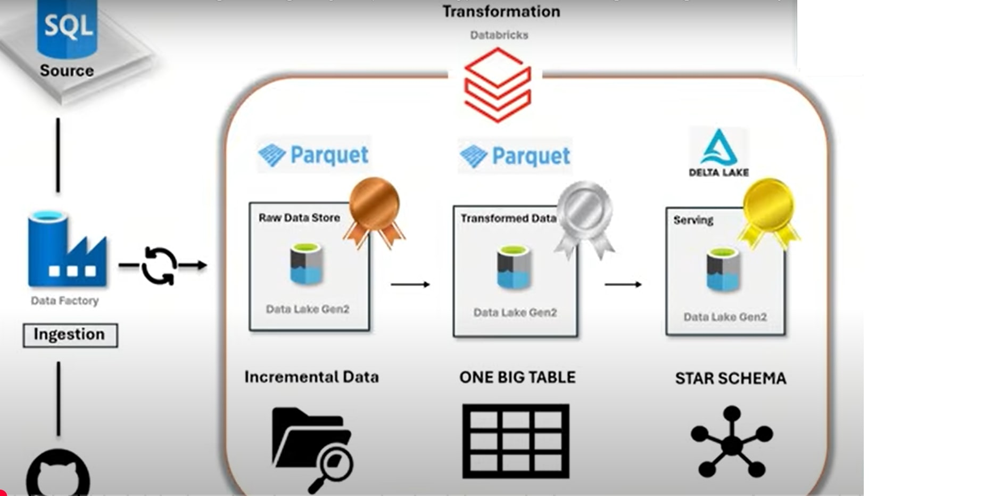
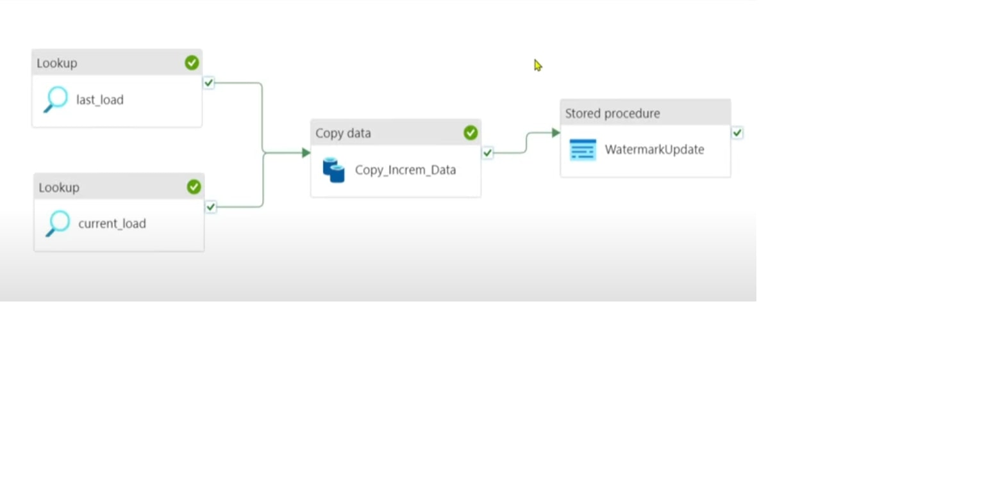
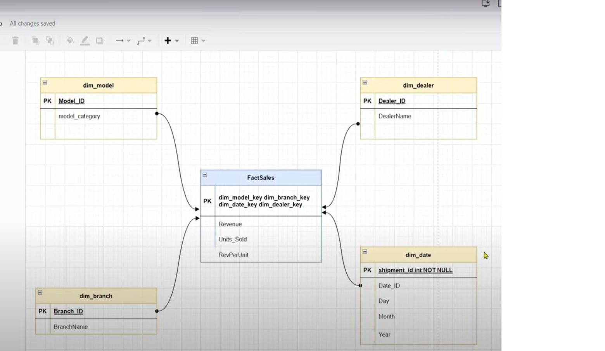

# Azure-End-To-End-Data-Engineering-Project

## 📌 Project Overview
This project demonstrates an end-to-end **Azure Data Engineering pipeline** following the **Medallion Architecture (Bronze → Silver → Gold)**.  
The goal is to ingest raw data, transform it into curated tables, build a **dimensional star schema**, and expose the data for **analytics & BI consumption**.

The project is inspired by real-world data engineering scenarios and emphasizes **incremental loading, data governance, and integration with Power BI** for reporting.

---

## 🏗️ Architecture

 

**Layers:**
- **Bronze** → Raw ingestion layer (stores unprocessed data).  
- **Silver** → Cleaned & transformed data (applies business rules, joins, and standardization).  
- **Gold** → Curated data in a **star schema** (fact & dimension tables) optimized for analytics.  

---

## 🚀 Tech Stack
- **Azure Data Lake** → Centralized data storage (Bronze/Silver/Gold).  
- **Azure Data Factory (ADF)** → Orchestration & pipeline automation.  
- **Azure Databricks** → Data transformation & incremental loading (CDC).  
- **Azure SQL Database / Synapse** → Data warehouse for serving curated data.  
- **Unity Catalog (Databricks)** → Data governance, security, and lineage tracking.  
- **Power BI** → Business Intelligence dashboards & visualization.  

---

## ⚙️ Project Workflow

1. **Data Ingestion (Bronze Layer)**  
   - Raw files ingested into **Azure Data Lake**.  
   - ADF pipelines scheduled for ingestion.

       

2. **Data Transformation (Silver Layer)**  
   - Cleansing, deduplication, and transformations in **Databricks (PySpark)**.  
   - Implemented **incremental load (CDC)** for efficiency.  

3. **Dimensional Modeling (Gold Layer)**  
   - Designed **Star Schema** with Fact & Dimension tables.  
   - Handled **Slowly Changing Dimensions (SCD Type 2)**.
  
      

4. **Data Governance**  
   - Managed access & lineage with **Databricks Unity Catalog**.  

5. **BI Reporting**  
   - Connected **Power BI** to Gold Layer for analytics.  
